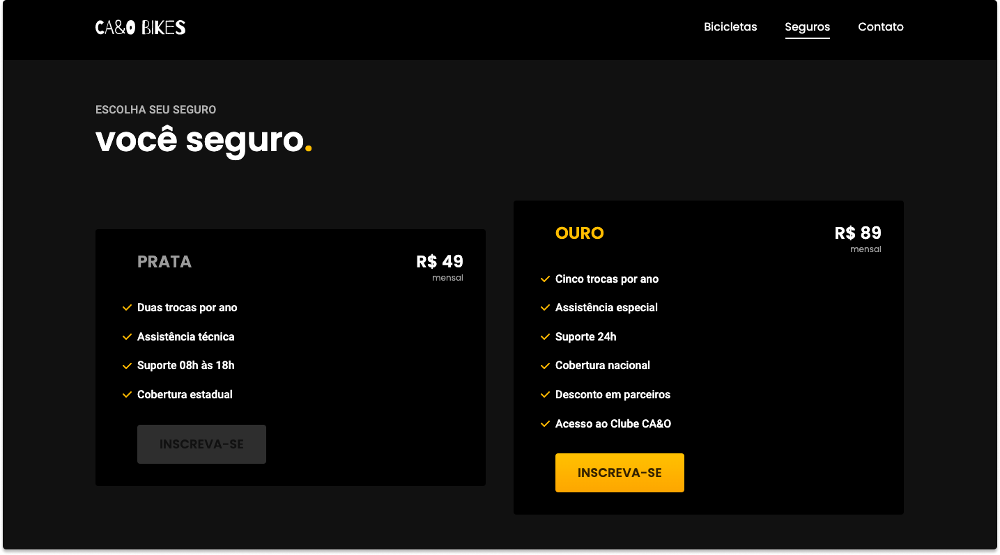

# CA&O BIKES



<p align="center">
  
</p>

> Projeto construído no curso de HTML e CSS da Origamid. O CA&O BIKES é um setor da empresa fictícia CA&O, voltado para o comércio de bicicletas elétricas e sustentáveis.


## 🔧 Tecnologias e ferramentas utilizadas
- HTML5
- CSS3
- Javascript (com o plugin [Simple Anime](https://github.com/origamid/simple-anime))
- PHP (com o [PHP MAILER](https://github.com/PHPMailer/PHPMailer))


## 🔖 Ajustes e melhorias

O projeto possui um formulário feito em PHP (PHP FORMS) na página de contato do qual só funcionará em um servidor com suporte a esta linguaguem.

- [x] Criar um formulário funcional
- [x] Ajustar responsividade para smartphones antigos
- [ ] Hospedar o website em um servidor com suporte


## 💻 Acessando o website
Você pode acessar o projeto [clicando aqui.](https://caiokenedy.github.io/CAIO-BIKES/)


## 🚀 executando o projeto

```bash
#### Clone o repositório
git clone https://github.com/CaioKenedy/CAIO-BIKES

#### Entre no diretório
cd CAIO-BIKES
```
Depois disso, utilize uma ferramenta como o [Live Server](https://marketplace.visualstudio.com/items?itemName=ritwickdey.LiveServer) para criar um servidor local e executar o projeto.


## 📫 Contribuindo para <CA&O-BIKES>

Para contribuir siga estas etapas:

1. Bifurque este repositório.
2. Crie um branch: `git checkout -b <nome_branch>`.
3. Faça suas alterações e confirme-as: `git commit -m '<mensagem_commit>'`
4. Envie para o branch original: `git push origin <nome_do_projeto> / <local>`
5. Crie a solicitação de pull.

Como alternativa, consulte a documentação do GitHub em [como criar uma solicitação pull](https://help.github.com/en/github/collaborating-with-issues-and-pull-requests/creating-a-pull-request).


### 📝 Licença

Esse projeto está sob licença. Veja o arquivo [LICENÇA](LICENSE.md) para mais detalhes.

[⬆ Voltar ao topo](#CA&O-BIKES)<br>
